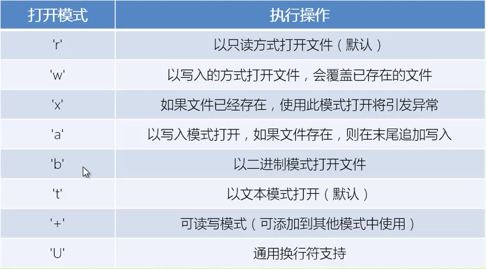

Python
===
##  基础语法
* 标识符
  - 第一个字符必须是字母表中字母或下划线
  - 标识符的其他部分有字母、数字和下划线组成
  - 标识符对大小写敏感
  - 在python3中，非ASCII表示符也是允许的。亲测，可以使用汉字。
* Python保留字
  - 保留字即关键字，不能用作任何标识符的名称
```python
	>>> import keyword
	>>> keyword.kwlist
	['False', 'None', 'True', 'and', 'as', 'assert', 'break', 'class', 'continue',
	'def', 'del', 'elif', 'else', 'except', 'finally', 'for', 'from', 'global', 'if',
	'import', 'in', 'is', 'lambda', 'nonlocal', 'not', 'or', 'pass', 'raise','return',
	 'try', 'while', 'with', 'yield']
```
* 注释
  - python中单行注释用#开头，多行注释用三个单引号(''')或者三个双引号(""")将注释括起来。
* 行与缩进
  - python最具特色的就是使用缩进来表示代码块。缩进的空格数是可变的，但是同一个代码块的语句必须包含相同的缩进空格数。
  - 在idle中，按下Alt+n上一条语句，Alt+p下一条语句
  - 查看内置函数(BIF):dir(\_\_builtins__)
  - help(BIF):获取内置函数的说明
* 声明
  + Python中的变量不需要声明。每个变量在使用之前都必须赋值，变量赋值以后该变量才会被创建。
   + 在Python中变量就是变量，它没有类型，我们所说的类型是变量在内存中对象的类型。
* 数据类型
  1. Numbers (数字):int 、float、bool、complex(复数)
    - Python可以同时为多个变量赋值，如a,b = 1,2
    - 一个变量可以通过赋值指向不同类型的对象
    - 数值的除法(/)总是返回一个浮点数，要获取整数使用(//)操作符
    - 在混合计算时，Python会把整型转换为浮点数
    - ‘\_’, 只读变量，交互模式下，最后输出的表达式结果赋值给‘\_’
    - isinstance(222,int):判断数据类型
  2. String (字符串)
    - Python中字符串用单引号('')或双引号("")括起来，同时使用反斜杠(\)转义特殊字符
    - 可以是字符串前面添加一个r或R，表示原始字符串
    - 反斜杠可以作为续行符，表示下一行是上一行的延续。还可以使用"""..."""或者'''...'''跨越多行
    - 字符串可以使用 + 运算符连接在一起，或者使用 * 运算符重复
    - 字符串有两种索引方式，
      1.从左往右，从0开始依次增加。
      2.从右往左，从-1开始依次减少
      3.Python没有单独的字符类型，一个字符就是长度为1的字符串。
    - 字符串可以切片，获取一段子串，形式为：变量名[头下标:尾下标]，截取范围是前开后闭，且两个索引都可以省略。
    - Python中的字符串不能改变
    - 使用将list转换为字符串, join()只能用于元素是字符串的list
    - split()与join()正好相反,它将一个字符串分割成多元素list
  3. List(列表)：使用最频繁的数据类型
    - 列表是写在方括号之间、用逗号分隔开的元素列表。列表中元素的类型可以不相同
    - 列表也可以被索引和切片，还可以使用"+"操作符进行串联操作
    - List中的元素是可以改变的
    - 列表1=列表2,指向同一个对象，列表1 = 列表2[:],则复制一份对象
  4. Tuple(元组)
    - 元组写在小括号内，元素之间用逗号隔开。
    - 元组可以被索引，也可以被切片。字符串可以看做一种特殊的元组
    - 元组可以有多种类型子元素，但元素不能被修改
    - 元组可以使用"+"操作符进行拼接, *重复操作符
    - 元组输出时总是有括号的，以便于表达正确的嵌套结构
  ```Python
  	tup1 = () #空元组
  	tup2 = (20,) # 一个元素，需要在元素后添加逗号
  ```
  	   string、List 和tuple都属于sequence(序列)
  5. Sets(集合)
    - 集合(set)是一个无序不重复元素的集
    - 基本功能是进行成员关系测试和消除重复元素
    - 可以使用大括号或者set()函数创建set集合。
    - 创建空集合必须用set()而不是{},因为{}是用来创建一个空字典。
    - set可以进行集合运算：
      * setA - setB #差集
      * setA | setB #并集
      * setA & setB #交集
      * setA ^ setB #求不同时存在的元素
  6. Dictionaries(字典)
    - 字典是一种映射类型(mapping type), 它是一个无序的键:值对集合
    - 关键字必须使用不可变类型，就是说list和包含可变类型的tuple不能做关键字。关键在还必须互不相同
    - 字典的一些内置函数:构造函数：dict()。clear(),keys(),values()
    - 创建空字典使用{}
    - 遍历字典时，关键字和对应值可以使用items()方法同时解读出来。
* 运算符
  1. 算术运算符
    - \+ 加-两个对象相加
    - \- 减-得到负数或是一个数减去另一个数
    - \* 乘-两个数相乘或是返回一个被重复若干次的字符串
    - / 除-x/y
    - % 取模-返回除法的余数
    - ** 幂-返回x的y次幂
    - // 取整数-返回商的整数部分
  2. 比较运算符
    - == 等于-比较对象是否相等
    - != 不等于-比较两个对象是否不相等
    - \> 大于-返回x是否大于y
    - < 小于-返回x是否小于y，所有比较运算符返回1表示真，返回0表示假
    - \>= 大于等于-返回x是否大于等于y
    - <= 小于等于-返回x是否小于等于y
  3. 赋值运算符
    - = 简单的赋值运算符
    - +=加法赋值运算符
    - -=减法赋值运算符
    - *=乘法赋值运算符
    - /=除法赋值运算符
      - %=取模赋值ysf
      - **= 幂赋值ysf
      - //=取整除赋值运算符 
  4. 位运算符：按位运算符是把数字看做二进制来进行计算
    - &按位与，参与运算的两个值，如果两个相应位都为1，则该位的结果为1，否则为0
    - |按位或，只要对应的二个二进位有一个为1时，结果位就为1
    - ^按位异或，当两对应的二进位相异时，结果为1
    - ~按位取反，对数据的每个二进制位取反，即把1变为0，把0变为1
    - <<左移动运算符，运算数的各二进位全部左移若干位，由'<<'右边的数指定移动的位数，高位丢弃，低位补0
    - \>> 右移动运算符，把">>"左边的运算数的各二进位全部右移若干位，'>>'右边的数指定移动的位数
  5. 逻辑运算符
    - and ： x and y 布尔与-如果x为False，x and y返回False，否则他返回y的计算值。		
    - or  ： x or y 布尔或-如果x是True，他返货x的值，否则返回y的计算值。         
    - not ：not x    布尔非-如果x为True，返回False。如果x为False，它返回True    
  6. 成员运算符
    - in ：如果在指定的序列中找到值返回True，否则返回False
    - not in: 如果在指定的序列中没有找到值返回True，否则返回False
  7. 身份运算符
    - is：is是判断两个标识符是不是引用自一个对象
    - is not ：is not是判断两个标识符是不是引用自不同对象。
      8.运算符的优先级

| 优先级  | 运算符                        | 描述         |
| ---- | -------------------------- | ---------- |
| 最高   | **                         | 指数         |
|      | ~ + -                      | 按位取反，一元加，减 |
|      | * / % //                   | 乘，除，取模和取整数 |
|      | + -                        | 加法，减法      |
|      | >> <<                      | 右移，左移运算符   |
|      | &                          | 位 &        |
| 高    | ^ \|                       | 位运算符       |
|      | <= < > >=                  | 比较运算符      |
|      | == !=                      | 等于运算符      |
|      | = %= /= //= -= += \*= \**= | 赋值运算符      |
|      | is  is not                 | 身份运算符      |
|      | in  not in                 | 成员运算符      |
| 最低   | not or and                 | 逻辑运算符      |

* 条件控制 ：if语句	

```Python
	if 条件1:
		语句块1
	elif 条件2:
		语句块2
	else:
		语句块3
```

	1. 每个条件后面要使用冒号(:), 表示接下来是满足条件后要执行的语句块
	2. 使用缩进来划分语句块，相同缩进数的语句在一起组成一个语句块
	3. 在Python中没有switch-case语句

* 循环
  1. while 循环

  ```Python
  while 判断条件:
      	语句块      

  for <变量> in <序列>:
      	语句块
  else:
      	语句块
  ```

  2. for语句
    + for循环可以遍历任何序列的项目
    + break语句可以跳出for和while循环体，如果从for或while循环终止，任何对应的循环else块将不执行
    + continue语句跳过当前循环块中剩余语句，然后继续进行下一轮循环
    + 循环语句可以有else子句，它在穷尽列表(for)或条件变为假(while)循环终止时被执行
  3. pass语句
    + pass语句什么都不做，它只在语法上需要一条语句但程序不需要任何操作时使用。

* 迭代器
  1. 迭代器是Python最强大的功能之一，是访问集合元素的一种方式。
  2. 迭代器是一个可以记住遍历的位置的对象
  3. 迭代器对象从集合的第一个元素开始访问，直到所有的元素被访问完结束。迭代器只能往前不会后退
  4. 迭代器有两个基本的方法：**iter()**和**next()**
* 生成器
  + 在Python中，使用了yield的函数被称为生成器(generator)
  + 跟普通函数不同的是，生成器是一个返回迭代器的函数，只能用于迭代操作，更简单点理解生成器就是一个迭代器
  + 在调用生成器运行的过程中，每次遇到yield时函数会暂停并保存当前所有的运行信息，返回yield的值。并在下一次执行next()方法时从当前位置继续运行
* 函数
  + Python定义函数使用def关键字，格式如下：
    ```Python
    	def 函数名(参数列表):
    		函数体
    ```
  + 定义在函数内部的变量拥有一个局部作用域，定义在函数外的拥有全局作用域
  + 函数也可以使用kwarg=value的关键字参数形式被调用。
  + 函数的返回值使用return语句
  + 可变参数，这些参数被包装进一个元组，在这些可变参数之前，可以有零到多个普通的参数, 也可以使用(*参数名)
  + 函数文档: \_\_doc__
  + 函数的返回值：可以是None或者元组
  + 在函数内部修改全局变量，Python会复制一个和全局变量名一样的局部变量，赋给新值，原来的全局变量不变。所以，在函数内访问全局变量可以，如果要修改修饰为： global 变量名
  + 内部函数的作用域都在外部函数之内。
  + 闭包：nonlocal 变量名
     - 在一个外函数中定义了一个内函数，内函数里运用了外函数的临时变量，并且外函数的返回值是内函数的引用。这样就构成了一个闭包。
     - 一般情况下，在我们认知当中，如果一个函数结束，函数的内部所有东西都会释放掉，还给内存，局部变量都会消失。但是闭包是一种特殊情况，如果外函数在结束的时候发现有自己的临时变量将来会在内部函数中用到，就把这个临时变量绑定给了内部函数，然后自己再结束。
  + 匿名函数：lambda 参数：返回值
  + filter(): 返回一个可序列化的对象，第一个参数为函数名或None，第二个参数为可迭代对象。筛选函数返回值为
    True的可迭代对象，丢掉返回值为False的
  + map(func, *iterables)：利用参数函数计算结果生成一个迭代对象，函数的参数为第二个map的第二个参数
***
##  数据结构
* 列表： 列表的方法

  | 方法                | 描述(L:列表，i：下标，x: 元素)                      |
  | ----------------- | ---------------------------------------- |
  | list.append(x)    | 把一个元素添加到列表的结尾                            |
  | list.extend(L)    | 通过添加指定列表的所有元素来扩充列表                       |
  | list.insert(i, x) | 在指定位置插入一个元素，第一个参数是准备插入到其前面的那个元素的索引       |
  | list.remove(x)    | 删除列表中值为x的第一个元素。如果没有这样的元素，就会返回一个错误        |
  | list.pop([i])     | 在列表的指定位置删除元素，并将其返回。如果没没有指定元素，删除返回最后一个元素。 |
  | list.clear()      | 移除列表中的所有项，等于del list[:]                  |
  | list.index(x)     | 返回列表中第一个值为x的元素的索引，如果没有匹配的元素就会返回一个错误      |
  | list.count(x)     | 返回x在列表中出现的次数                             |
  | list.sort()       | 对列表中的元素进行排序                              |
  | list.reverse()    | 对列表中的元素进行倒序                              |
  | list.copy()       | 返回列表的浅复制，等于a[:]                          |
  *pop([i])方法中i两边的方括号表示这个参数是可选的，而不是要求输入一对方括号。*

  1. 将列表做堆栈使用，用append()方法把一个元素添加到栈顶，用不指定索引的pop()方法可以把一个元素从栈顶释放出来
  2. 将列表当作队列使用，但是效率不高。因为在列表的最后添加或者弹出元素速度快，然而在列表里面插入或者从头部弹出速度却不快（因为所有其他元素都得一个一个地移动）
  3. 列表推导式，提供了创建列表的简单途径。通常应用程序将一些操作应用于某个序列的每个元素，用其获得的结果作为生成新列表的元素，或者根据确定的判定条件创建子序列。
  4. 每个列表推导式都在for之后跟一个表达式，然后有零到多个for或if子句。返回结果是一个根据表达从其后的for和if上下文环境中生成出来的列表。如果希望推导出一个元组，就必须使用括号。
  5. del语句用法：del a[0], del a[2:4], del a[:], del a
  6. 在遍历序列时，索引位置和对应值可以使用enumerate()函数同时得到。
  7. 同时遍历两个或多个序列时，可以使用zip()组合
  8. 要反向遍历一个序列，调用reversed()函数
  9. 要顺序遍历一个序列，使用sorted()函数返回一个已排序的序列，并不修改原值。
* 序列
   1. 列表, 元组和字符串的共同点
   2. 默认索引值总是从0开始
   3. 可以通过分片的方法得到一个范围内的元素的集合
   4. 有很多共同的操作(重复操作符(*), 拼接操作符(+), 成员关系操作符(in/not in))


* 递归

* 模块

  + 模块是一个包含所有你定义的函数和变量的.py文件，模块可以被别的程序引入，以使用该模块中的函数等功能，这也是使用Python标准库的方法。
  + 模块除了方法定义，还可以包含可执行的代码。这些代码用来初始化这个模块，这些代码只有在第一次被导入时才会被执行
  + 每个模块有各自独立的符号表，在模块内部为所有的函数当作全局符号表来使用
  + 模块是可以导入其他模块的，被导入的模块的名称将被放入当前操作的模块的符号表中。
  ```Python
  	import 模块名
  	from 模块名 import 函数名...
  	from 模块名 import *
  ```
  + 一个模块被另一个程序第一次引入时，其主程序将运行。如果我们想在模块被引入时，模块中的某一块程序不执行，我们可以用__name__属性来使该程序块仅在该模块自身运行时执行。每个模块都有一个__name__属性，当其值是__main__时，表明模块自身在运行，否则是被引入。
  + 内置函数dir()可以找到模块内定义的所有名称，以一个字符串列表的形式返回。如果没有给定参数，dir()函数会罗列出当前定义的所有名称。
  + 标准模块
  + 包：包是一种管理Python模块命名空间的形式，采用“点模块名称”。比如一个模块的名称是A.b,那么他表示一个包A中的子模块B，采用点模块名的形式避免不同库之间的模块重名情况。

* 输出格式
  1. Python两种输出值的方式：表达式语句和print()函数。
  2. 使用str.format()函数可以实现更加形式多样的格式化输出
  3. 如果要将输出的值转化成字符串，可以使用repr()或str()函数来实现，str()函数返回一个用户易读的表达形式。repr()产生一个解释器易读的表达形式，repr()函数可以转义字符串中的特殊字符，repr()的参数可以是Python的任何对象
  4. 字符串对象的rjust()方法将字符串靠右，并在左边填充空格。类似的有ljust()和center()方法。zfill()方法会在数字的左边填充0.
  5. '{0}...{1}'.format(args)花括号及其里面的字符会被format()中的参数替换。花括号中的数字用于指向传入对象在format()中的位置(以0开始).如果{}中使用关键字参数，它们的值会指向使用该名字的参数。
  6. {}中可以使用'!a'(使用ASCII), '!s'(使用str())和'!r'(使用repr())在格式化某个值之前对其转化。
  7. {i:.nf},其中i为format参数索引，'.nf'表示小数点后n位。若为'nd'表示至少有这么多的宽度。

* File方法

  

* OS文件/目录方法

* 错误和异常

* * *

##  面向对象
* 面向对象技术简介
  + 类(class): 用来描述具有相同的属性和方法的对象的集合。它定义了该集合中每个对象所共有的属性和方法。对象是类的实例
  + 类变量：类变量在整个实例化的对象中是公用的。类变量定义在类中且在函数体之外。类变量通常不作为实例变量使用。 
  + 数据成员：类变量或者实例变量用于处理类及其实例对象的相关的数据
  + 方法重写：如果从父类继承的方法不能满足子类的需求，可对其进行改写，这个过程叫方法的覆盖(override), 也称为方法的重写。
  + 实例变量：定义在方法中的变量，只作用于当前实例的类
  + 继承：即一个派生类(derived class)继承基类(base class)的字段和方法。继承也允许把一个派生类的对象作为一个基类的对象对待。
  + 实例化： 创建一个类的实例，类的具体对象
  + 方法：类中定义的函数
  + 对象：通过类定义的数据结构实例。对象包括两个数据成员(类变量和实例变量)和方法
  + 类的继承机制允许多个基类，派生类可以覆盖基类中的任何方法，方法中可以调用基类中的同名方法，对象可以包含任意数量和类型的数据。
* 类定义
  ```Python
  	class ClassName:
  		<statement1>
  		...
  ```
* 类对象
  + 类对象支持两种操作：属性引用(obj.name)和实例化
  + 构造方法:\_\_init\_\_()，类实例化时会自动调用\_\_init\_\_()方法。参数也可通过\_\_init__()方法传递到类的实例化操作上
* 类的方法
  + 在类的内部，使用def关键字可以为类定义一个方法，与一般函数定义不同，类方法必须包含参数self，且作为第一个参数。
* 继承

  + 基类必须与派生类定义在一个作用域内，除了类名，还可以用表达式，当基类定义在另一个模块中时，这一点很有用。
* 多继承
  + 若是基类中有相同的方法名，而在子类使用时未指定，Python从左至右搜索，即方法在子类中没找到时，从左到右查找基类中是否包含该方法。
  ```Python
  	class 派生类名(基类1，基类2，...)：
  		<statement1>
  		...
  ```
* 方法重写
  + 如果父类方法的功能不能满足需求时，可以在子类重写父类的方法

* 类的私有属性
  + __private_attrs:两个下划线开头，声明该属性为私有，不能在类外部被使用或直接访问，在类内部方法中使用self.__private_attrs.  还可以访问:_类名__私有属性名
  + __private_method:两个下划线开头，声明该方法为私有方法，不能在类外部调用。在类内部调用self.__private_method.
* 类的专有方法：
  + \_\_init__:--构造函数，在生成对象时调用
  + \_\_del__:--析构函数，释放对象时使用
  + \_\_repr__:--打印，转换
  + \_\_setitem__:--按照索引赋值
  + \_\_getitem__:--按照索引取值
  + \_\_len__:--获得长度
  + \_\_cmp__:--比较计算
  + \_\_call__:--函数调用
  + \_\_add__:--加运算
  + \_\_sub__:--减运算
  + \_\_mul__:--乘运算
  + \_\_div__:--除运算
  + \_\_mod__:--求余运算
  + \_\_pow__:--乘方
* 运算符重载
  + 我们可以对类的专有方法进行`重载`
* 绑定:Python严格要求方法需要有实例才能被调用,这种限制就是python所谓的绑定概念.
* 继承与组合:类的横向关系用组合,类的纵向关系用继承
* mix-in
* OS
* pickle:读取或写入模式"wb/rb"
  + dump(object, file)
  + load(file)

### 正则表达式
* 定义: 正则表达式是一个特殊的字符序列, 它能帮助你方便的检查一个字符串是否与某种模式匹配.
	+ Python 的re模块, 它提供Perl风格的正则表达式模式, re模块使Python语言拥有全部功能的正则表达式功能
	+ compile 函数根据一个模式字符串和可选的标志参数生成一个正则表达式对象, 该对象拥有一系列方法用于正则表达式匹配和替换.
	+ re模块也提供了与这些方法功能完全一致的函数, 这些函数使用一个模式字符串作为他们的第一个参数
* re.match()尝试从字符串的起始位置匹配一个模式, 如果不是起始位置匹配成功的话, match()就返回None
* re.search() 扫描整个字符串并返回第一个成功的匹配
* match与search 的区别: match只匹配字符串的开始, 如果字符串开始不符合正则表达式,则匹配失败,函数返回None, search则匹配整个字符串, 直到找到一个匹配.
* re.sub()用于替换字符串中的匹配项, 返回的字符串是在字符串中用re最左边不重复的匹配来替换.如果模式没有发现, 字符将被没有改变第返回.
* 正则表达式修饰符
	+ 正则表达式可以包含一些可选标志修饰符来控制匹配的模式. 修饰符被指定为一个可选的标志. 多个标志可以通过按位OR(|)它们来指定.
	
| 修饰符 |             描述            |
|  ---   |      ---                   |
| re.I   | 使匹配的大小写不敏感     |
| re.L | 做本地化识别(locale-aware)匹配 |
| re.M | 多行匹配,影响^和$ |
| re.S | 使.匹配包括换行在内的所有字符 |
| re.U | 根据Unicode字符集解析字符,这个标志影响\w, \W, \b, \B |
| re.X | 该标志通过给予你更灵活的格式以便你将正则表达式写的更易于理解 |

* 正则表达式模式:
	+ 模式字符串使用特殊的语法来表示一个正则表达式
	+ 字母和数字表示他们自身, 一个正则表达式模式中的字母和数字匹配同样的字符串
	+ 多数字母和数字前加一个反斜杠时会拥有不同的含义
	+ 标点符号只有被转义时才匹配自身,否则它们表示特殊的含义
	+ 反斜杠本身需要输液反斜杠转义
	+ 最好使用原始字符串来表示正则表达式,如r'string'


		


